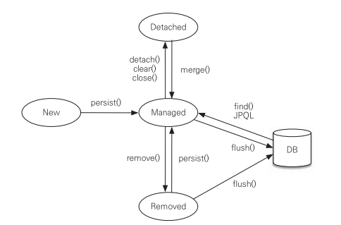

[JPA]
- JPA란?
	- JPA(Java Persistence API)란 자바 진영에서 ORM(Object-Relational Mapping) 기술 표준으로 사용되는 인터페이스의 모음으로, 구현된 클래스와 매핑을 해주기 위해 사용되는 프레임워크. JPA를 구현한 대표적인 오픈소스로는 Hibernate, Spring Data JPA가 존재.
- JPA 사용 이유
	- 장점: Method를 통해 DB 조작 가능으로 개발자는 객체 모델을 이용하여 비즈니스 로직을 구성하는데만 집중할 수 있음.
	- 단점: 속도 저하 및 일관성 문제, 복잡하고 무거운 Query는 별도 튜닝이 필요하기 때문에 SQL문을 써야할 수 있음
- JPA 영속성 컨텍스트
	- 영속성(영구적인 저장)을 관리하는 환경
	- Entity Manager 를 통해 Entity 를 저장 및 조회하면 em 이 Persistance Context 에 Entity 를 저장 및 관리함
	- 트랜잭션 커밋 시에 flush() 가 호출되면서 실제로 DB 에 저장됨
	- 1차 캐시, 동일성 보장, 쓰기 지연, 변경 감지, 지연 로딩
    
- JPA N+1 문제
	- 연관 관계에 있는 객체에 Eager(즉시 로딩) 설정 시, 객체 호출 시 연관 관계의 객체들까지 n 번 더 호출하는 문제
- JPA N+1 문제의 해결
	- fetch-join: 설정 시 연관된 엔티티도 join 할 때 같이 찾아 한 번에 조회 가능 단, 지연 로딩보다 우선순위가 높아 즉시로딩으로 동작
- JPA Transaction 전파
	- @transactional 어노테이션의 propagation 속성으로 설정 가능
	1. REQUIRED: 기본값, 기존 트랜잭션이 있는 경우 사용, 없으면 새로운 트랜잭션 생성
	2. REQUIRED_NEW: 항상 새로운 트랜잭션 생성
	3. SUPPORTS: 기존 트랜잭션이 있는 경우 사용, 없으면 없는대로 진행
	4. NOT_SUPPORTS: 트랜잭션이 있든 없든 없이 사용
	5. MANDATORY: 기존 트랜잭션이 있는 경우 사용, 없으면 예외 발생
	6. NEVER: 기존 트랜잭션이 있는 경우 예외 발생, 없으면 그대로 진행
	7. NESTED: 기존 트랜잭션이 있는 경우 중첩 트랜잭션 실행, 없으면 새로운 트랜잭션 실행
- OSIV
	- Open session in view: 영속성 컨택스트 생명주기를 HTTP 요청의 시작부터 끝까지 연장하는 것 -> 기존은 트랜잭션 범위 안에서만 영속성 컨텍스트가 동작
	- 비즈니스 계층부터 view 까지 영속성 컨텍스트가 살아 view 랜더링 시에도 쿼리문이 나갈 수 있고, 계층 간 분리가 약화