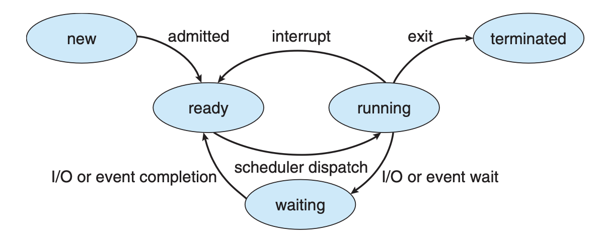

[운영체제]

### 운영체제란 무엇인가?

컴퓨터의 하드웨어를 관리하는 프로그램이자, 사용자와 하드웨어를 연결해주는 기반이 되는 프로그램.

사용자 <-> 어플리케이션 프로그램 <-> 운영체제 <-> 하드웨어

하는일
- 자원 할당의 주체 -> 모든 자원을 관리(CPU, memory, network, disk 등), 이들을 효율적으로 분배
- 제어 프로그램 -> 프로그램의 실행으리 관리해 에러를 방지하고 잘못된 사용을 막음

구조: user interface(CLI, batch, GUI 등), system call, services(file system, program execution, I/O operation...)

### 커널이란 무엇인가?

> 프로그램 -> 프로세스
> 하드웨어를 사용자 대신 제어
> 시스템 자원 관리

벤더 사에 상관 없이, 컴퓨터에서 항상 돌아가야하는 단 하나의 프로그램이 바로 커널, 운영체제의 핵심
커널은 두 종류의 프로그램으로 이루어짐
- 시스템 프로그램: OS 와 관련된 프로그램
- 어플리케이션 프로그램: 그 외 프로그램

### 커널모드 vs 유저모드

인터럽트는 보통 비동기적으로 발생함.
소프트웨어 에러 혹은 요청은 예외 혹은 트랩을 발생함
여기서, OS 가 스스로와 다른 시스템을 보호하기 위해 듀얼 모드를 사용함.
CPU 가 제공 하는 Mode bit 을 통해 구분되며, 1 = user mode, 0 = kernel mode
사용자의 코드를 실행하는 환경과 커널 코드를 실행하는 환경을 분리
일반적의 경우 유저모드에서 프로그램일 실행되며, 시스템 콜이 불렸을 때 트랩이 발생하여 커널 모드로 전환한다.
이후 커널 모드에서 시스템 콜을 처리한 후 다시 유저 모드로 복귀한다.

### 시스템 콜

> 유저 모드에서 커널이 하는 일을 요청할 때에 사용
<br> 호출 시 트랩 발생

OS 에 의해 제공되는, 이미 구현된 인터페이스(보통 C, C++ 로 쓰여짐)
다른 프로그램에게는 직접 호출 대신 API 를 통해 호출됨
시스템 콜 인터페이스를 통해 user mode 와 kernel mode 의 행동을 이어줌

### 인터럽트 vs 트랩

>
- 공통점: 프로세스 실행 중 상황 발생 시 처리 이후 복귀하는 것
- 인터럽트:
    - 하드웨어 인터럽트: 하드웨어에 의해 발생(인터럽트 핀)
    - 소프트웨어 인터럽트: 오류, 예외 등
- 트랩: 소프트웨어에 의해 발생(시스템 콜)

인터럽트: 유저, 커널, 하드웨어 컨트롤러 등으로부터의 I/O 요청
OS 는 지금 실행되고 있는 프로세스의 상태를 레지스터와 program count 를 통해 저장하고 인터럽트 코드를 실항하고 그것으로부터 복구한다.
인터럽트 발생 시 처리: 프로세스 정지 - program counter 를 interrupt service routine(ISR) 로 옮김 - ISR 코드를 실행 - 정지된 프로세스로 복귀

### DMA(Direct Memory Access)

고속의 I/O 장치로부터 메모리 속도에 근접하게 빠르게 정보를 전달하기 위함.

장치 관리자는 버퍼 저장공간과 메인 메모리 사이로 데이터 블럭을 CPU 간섭 없이 직접 전달함.
블럭 단위로 인터럽트가 발생하기 때문에 바이트별로 발생하는 것 보다 효율적

### 프로세스란?

>
- 보조기억장치의 프로그램 -> 메모리에 적재 및 CPU 를 할당받을 수 있는 상태
- 독립적인 메모리 공간을 가진다
- 리눅스는 PCB 로 관리

프로그램이 실행되는 것, 작업 단위.
프로그램이 수동적 상태라면, 프로세스는 능동적 상태
프로세스는 작업을 수행하기 위해 자원이 필요 - CPU, memory, I/O, files, 초기화된 데이터 등

메모리 공간에서 0부터 text secetion(코드, pc, processor register를 보관, static), data section(전역 변수 보관, static), heap(런타임에서 동적으로 할당되는 메모리를 위한 공간), max 부터 stack(일시적인 데이터(함수 파라미터, 반환 주소, 지역 변수 등))


한 program counter 가 한 프로세스(멀티쓰레드 환경에서 쓰레드) 마다 존재, 이는 다음으로 실행할 명령의 위치를 표시(CPU 는 PC 가 가르키는 메인 메모리의 위치로부터 코드나 데이터를 불러옴)

PCB(process control block) 에 정보가 저장되며, 이를 통해 CPU 는 끊임없이 여러 프로세스를 다룰 수 있음.

프로세스 스케줄링: 스케줄러에 의해 CPU 에서 다음 작업을 처리할 프로세스를 결정함.
Job Queue(실행된 프로세스, 메모리 점유 대기중인 프로세스), Ready Queue(메인 메모리에서 준비 혹은 대기 프로세스), Device Queue(I/O 장치 대기 프로세스) 로 나누어 관리

### 스레드

한 프로세스가 여러 개의 program counter 를 가진다면? -> 비동기적으로 다양한 파일 위치를 저장할 수 있음 -> 쓰레드의 개념
한 프로세스에서 code, data, files 를 공유하지만, 쓰레드별로 register, stack 을 따로 가짐

### 멀티스레딩

한 프로세스에 스레드가 여려개.
유저 스레드와 커널 스레드 사이의 관계에 따라 one-to-one, many-to-one, many-to-many 관계가 존재.
- one-to-one: 각 유저 스레드가 커널 스레드와 연관
- many-to-one: 한 커널 스레드가 스레드 라이브러리를 통해 유저 스레드와 연결
- many-to-many: lightweightProcess 가 커널 스레드와 스레드 라이브러리를 연결

>
- 컨텍스트 스위칭 시 스택 메모리만 갈아끼면 되니 코스트 적음, 단점으로 자원이 공유되어 동시성 문제 발생 가능

### 멀티 프로세싱

>
- 프로세스가 여러개이면 스위칭 시 PCB 를 모두 옮겨야 함, 프로세스 간 자원 공유 안됨 -> 서로 통신 위해 IPC -> pipe, shared memory, socket 등

코어(프로세스)가 여러개, 데이터, 작업을 병렬로 처리할 수 있음

### 컨텍스트 스위칭

CPU 가 다른 프로세스로 스위칭될 때, 시스템은 이전 프로세스의 상태를 저장해야 하고, 새로운 프로세스의 상태를 불러와야 한다. 이 과정을 컨택스트 스위칭이라고 한다.
컨택스트 스위칭이 일어나면, 커널이 이전 프로세스의 정보를 PCB 에 저장하고, 새로운 프로세스의 정보를 PCB 로부터 불러와 실행한다.
스위칭이 일어는 동안 시스템이 작업할 수 없으므로 코스트가 큰 작업이다. 따라서 이는 하드웨어의 속도에 영향을 많이 받는다. 

### 리눅스 스케줄러 종류

>
CFS, real-time scheduler

short-term scheduler(CPU scheduler): 무슨 프로세스가 다음으로 실행되어야 하는지 결정하고 CPU 에 할당, 빨라야함(ms 단위)
long-term scheduler(job scheduler): 무슨 프로세스가 ready queue 로부터 불러와져야 하는지 결정(sec, min 단위, 멀티 프로그래밍 차수를 결정)
mid-term scheduler: 멀티 프로그래밍 차수를 줄이기 위해 필요, 메모리로부터 프로세스를 제거, 디스크에 저장, 디스크로부터 복귀를 관리


### 프로세스의 상태

프로세스는 아래 다섯 상태로 관리됨.


### 스케줄링 기법

ready queue 는 일정한 순서에 따라 프로세스를 정해야 함.

아래의 경우 비선점형 스케줄링(CPU 반환까지 다른 프로세스가 점유 불가능) 사용
- (프로세스 상태가)running -> waiting(자발적)
- running -> ready
- waiting -> ready
- terminate(자발적)
그 외의 경우 선점형 스케줄링(우선순위가 높은 프로세스가 현재 프로세스를 중단시키고 점유)

Dispatcher: short-term scheduler 에 의해 선택된 프로세스를 CPU 가 다룰 수 있도록 함
- 컨텍스트 스위칭, 유저 모드로 모드 변경, 프로그램을 재실행하기 위해 적절한 위치로 이동 등
디스패처가 한 프로세스를 중단하고 다른 프로세스를 실행하기까지 걸리는 시간: dispatch latency

스케줄링은 다음을 고려해야 함:
- CPU utilization 최대화
- Throughput(단위 시간 당 실행을 완료하는 프로세스의 수) 최대화
- Turnarount(특정 프로세스가 실행되는데 걸리는 시간) 최소화
- Waiting time(프로세스가 ready queue 에서 대기하는 시간) 최소화
- Response time(요청으로부터 첫 응답까지 걸리는 시간) 최소화

1. FCFC(First-Come, First-Served): 먼저 온 프로세스를 먼저 실행 - convoy effect: 긴 프로세스 뒤의 짧은 프로세스가 전체적인 시스템을 늦춘다.
2. SJF(Shortest-Job First): 각 프로세스의 다음 CPU burst 를 예측해, 짧은 작업부터 시행 - 최적이지만 다음 요청의 길이를 아는 것은 어려움: 추측이 필요
    - 다음 CPU burst 를 예측하는 방법: exponential averaging: 𝜏_(n+1) = ⍺ * t_n + (1-⍺) * 𝜏_n
    - t_n: n번째 CPU burst 의 실제 길이
    - 𝜏_n+1: 다음 CPU burst 로 예측하는 길이
    - ⍺: 0~1, 일반적으로 1/2 로 설정
    이런 선점형 SJF 를 shortest-remaining-time-first 라고 함
3. Priority Scheduling: 각 프로세스는 정수로 된 priority(낮을수록 높은 우선도)를 가지고, 이에 따라 스케줄링 계획
    - 문제점: Starvation: 낮은 우선도 프로세스가 계속 실행이 안될 수 있음
    - 해결: Aging: 시간이 지날수록 실행되지 않은 프로세스들의 우선도는 높아짐
4. Round Robin: 각 프로세스가 작은 단위의 CPU 시간, time quantum 혹은 time slice 를 가지고, 이 시간이 지나면 작업을 중단하고 ready queue 의 마지막으로 이동
    - n 개의 프로세스와 총 time quantum q가 있을 때 각 프로세스는 q/n 의 time quantum 을 가지기 때문에 어느 프로세스도 (n-1)*q 만큼의 시간 이상 기다리지 않는다.
    q 가 크면 FIFO 와 비슷해지고, q 가 작으면 컨텍스트 스위칭이 자주 일어나 오버헤드가 발생, 일반적으로 컨택스트 스위칭이 10 us 보다 작을 때 time quantum d을 10~100ms 로 둔다.
다양한 스케줄링 방식을 두는 multilevel queue 를 구성하기도 한다.

### 동기와 비동기

요청을 처리할 때까지 다른 작업을 수행하지 못함 = 블로킹 = 동기
요청이 완료되지 않아도 다른 작업을 수행할 수 있음 = 논블로킹 = 비동기

### 프로세스(스레드) 동기화

race condition: 공용 자원에 접근하는 여러 프로세스의 작업 실행 순서에 따라 결과가 달라지는 상태
critical section: 공용 변수, 테이블 업데이트, 파일 쓰기 등의 작업
```
//프로세스의 일반적인 구조
do {
    //entry section
        critical section
    //exit section
        remainder section
} while(true);
```

critical section problem 을 해결하기 위한 세 조건
1. Mutual Exclusion: 한 프로세스가 critical section 에 접근한 경우, 다른 어떤 프로세스도 이에 접근하면 안된다.
2. Progress: 아무런 프로세스도 critical section 에 있지 않고 대기하는 프로세스가 있는 경우, 다음으로 critical section 에 접근할 프로세스의 선택은 무기한 연기되면 안된다.
3. Bounded Waiting: 프로세스 대기의 상한 시간이 존재해야 한다.

- Peterson's Solution
    저장과 불러오는 작업은 atomic 하고, 두 프로세스가 int turn, boolean flag[2] 를 공유할 때의 알고리즘, turn 은 어느 프로세스가 critical section 에 진입할 차례인지, flag 는 각 프로세스가 critical section 에 진입할 준비가 되었는지를 저장하는 변수이다.
    이 때, 각 프로세스는 다음과 같은 알고리즘으로 동작하면 된다:
    ```
    do {
        flag[i] = true;
        turn = j;
        while (flag[j] && turn == j) ; //do nothing
            critical section
        flag[i] = false;
            remainder section
    } while(true);

위처럼, 실제로 프로세스를 동기화 할 때에도 locking 이라는 것을 사용 - critical section 을 잠금을 통해 보호
```
do {
    acquire lock
        critical section
    release lock
        remainder section
} while(true);
```

- Mutex lock
    atomic(non-interruptible) 한 acquire(), releas() 를 통해 잠금을 획득하고 놓는 과정으로 critical section 을 보호
    busy waiting(자원을 얻을 떄까지 기다리는 것이 아닌, 권한을 얻을 떄까지 계속 확인) 을 수행함(그래서 spinlock 으로도 불림)
```
acquire() {
    while (!available) ;
    available = false;
}
release() {
    available = true;
}
do {
    acquire lock
        critical section
    release lock
        remainder section
} while(true);
```

- Semaphore
    semaphore S = 정수 변수, 두 atomic 한 operation 에 의해서만 접근 가능:
        wait(), signal()(P(), V())
        ```
        wait(S) {
            while (S<=0) ;
            S--;
        }
        signal(S) {
            S++;
        }
        ```
    counting semaphore: S 의 범위가 넓음
    binary semaphore: S가 0, 1만 가능 -> mutex lock 과 동일

    busy waiting 은 여전히 발생

발생할 수 있는 문제:
- Deadlock: 서로가 점유하고 있는 자원을 기다리면서 무한 대기에 빠지는 상황
- Starvation: 한 프로세스가 계속 critical section 을 점유하지 못하는 상황
- Priority Inversion: 낮은 우선도의 프로세스가 높은 우선도의 프로세스가 필요한 자원을 점유하는 상황

예시 문제 상황:
- Bounded-Buffer Problem
- Readers and Writers Problem
- Dining-Philosophers Problem
    - Monitor: 

### 데드락

교착 상태

조건 4가지
상호 배제, 점유 대기, 비선점, 순환 대기

어떻게 해결하는가
보통 해당하는 프로세스 강제로 자원 해제


### 메모리 주소 바인딩

소스 코드는 보통 symbolic address 를 가짐
컴파일된 코드는 relocatable address 에 바인딩 됨
Linker 혹은 loader 가 relocatable address 를 absolute address 에 바인딩 함.

논리 주소 -> 물리 주소 바인딩 시점에 따른 분류
- 컴파일 타임: 실행 전에 주소가 결정되면 absolute code 가 생성될 수 있지만, 시작 주소가 바뀔 때 다시 컴파일 되어야 함
- 로드 타임: 컴파일 타임에 주소가 결정되지 않았다면 relocatable code 를 생성해 절대주소에 바인딩한다.
- 실행 타임: 실행이 한 메모리 세그먼트에서 다른 세그먼트로 이동할 수 있으려면 런타임까지 주소 바인딩이 늦춰져야 한다.
    MMU(memory-management unit) 에 의해 런타임에 가상 주소를 물리 주소로 매핑

### Swapping

프로세스가 메모리와 backing store 로 스왑되고, 다시 불러와져 이어 실행될 수 있다. 이를 통해 프로세스들이 사용하는 총 메모리 공간이 실제 메모리 공간보다 클 수 있다.
메모리 스왑이 이뤄지는 양은 transfer time 과 직결됨.
시스템은 ready-queue 로 실행될 프로세스를 관리하고, CPU 스케줄러가 프로세스를 실행하기로 결정하면 디스패쳐가 호출됨.
디스패쳐는 ready-queue 의 다음 프로세스가 메모리에 있는지 확인하고, 없다면 스왑할 프로세스를 찾아 swap-out하고 실행할 프로세스를 swap-in 해서 실행한다.

### 메모리 단편화

external fragmentation - 필요한 메모리 공간보다 hole 이 크지만, 이들이 연속되지 않은 경우
    compaction 으로 줄일 수 있음 - 사용하지 않는 메모리를 하나의 큰 블럭으로 모으기, relocation 이 동적일 때만 가능하고 실행 타임에 수행됨
internal fragmentation - 필요한 메모리 공간보다 프로세스에 할당된 메모리가 크지만, 다 사용되지 않는 경우

### 페이징

외부 단편화를 줄일 수 있지만, 내부 단편화는 존재

물리적 메모리를 고정된 크기의 frame 으로 나눔(512~16Mbtye)
논리적 메모리를 같은 크기의 page 로 나눔
모든 free frame(사용하지 않는 frame) 을 관리
N page의 프로그램을 실행하려면 N free frame 을 찾아 할당
page table 을 통해 논리 주소를 물리 주소로 변환
backing store 또한 page 로 나뉨

주소는 page number(page table의 인덱스, 물리적 메모리에서 각 페이지의 base address 를 찾기위함), page offset 로 구성

TLB(translation look-aside buffer) 로 page number <-> frame number 를 캐시


### 세그멘테이션

프로그램을 논리적 단위로 나누어 메모리에 적재하는 방법

내부 단편화를 줄일 수 있지만, 외부 단편화는 존재

segment table - base(물리 주소의 시작점), limit(세그먼트의 길이) 를 가짐
논리 주소는 segment_number, offset 으로 구성됨, segment_number 로 segment table에서 base, limit 을 찾아 사용

### 세그멘테이션-페이징 혼합

속도는 떨어질 수 있지만, 단편화를 줄일 수 있음
프로세스를 세그먼트로 나누고, 각 세그먼트를 페이징한다

### 가상 메모리

논리적 메모리(물리적 메모리와 상반), 보통 주소는 0부터 시작, MMU 에 의해 물리적 주소로 변환되어 시스템 내에서 사용

### Page Fault(페이지 부재)

메모리에 로드되지 않은 페이지를 사용하려 할 떄에 트랩 발생
올바르지 않은 참조 -> abort
메모리에 없는 경우 -> free frame 을 찾고, backing store 로부터 page 를 불러옴, page table 을 초기화하고 수행하던 작업 재실행

### 페이지 교체

free frame 이 없을 때, over-allocation 을 방지하고자 하는 알고리즘
modify(dirty) bit 을 사용해 page 전송의 overhead 를 방지 -> 수정된 페이지만 디스크에 쓰이도록

- basic page replacement
1. 디스크에서 원하는 페이지의 위치를 찾음
2. free frame 을 찾음
    1. 만약 있으면 사용
    2. 없으면 page replacement algorithm 에 따라 victim frame 을 선정, 그 frame 이 dirty 하면 디스크에 작성
3. 원하는 프레임으로 불러오고, page table, frame table 을 갱신
4. 트랩을 발생했던 곳으로 돌아가 이어 실행

frame-allocation algorithm - 각 프로세스에 몇 개의 프레임을 배정해야 할 지
page-replacement algorithm - 무슨 프레임이 교체될 지

reference string - 참조된 페이지 번호를 순서대로 저장한 스트링

FIFO, OPT, LRU, LRU approximation, Second-chance(clock, FIFO but reference bit = 0 -> replace, 1 -> set 0 and pass), Counting(LFU, MFU)

### Thrashing

프로세스가 충분한 페이지를 가지지 못할 때, page-fault 가 자주 발생하는 상황

- working set model
working-set window = reference string 에서 고정된 길이의 참조된 페이지들
working-set size of process = 가장 최근 시간(working-set window 의 길이만큼의) 동안 참조된 페이지의 수
wss의 합 > m(프레임의 개수) 이면 thrashing 발생 -> 프로세스를 suspend 혹은 swap-out 함
- page-fault frequency
page-fault rate 에 따라 프레임 수를 조절, upper bound 를 넘으면 프레임 수를 증가, lower bound 보다 낮으면 페이지 수를 감소

### 파일 시스템

file - secondaty storage 의 저장된 기록과 연관된 정보들에 대한 모음

attribute(name, identifier, type, location, size, protection, identification)
operation(create, write, read, reposition within file(seek), delete, truncate, open, close)

directory - single-level, two-level, tree-structured, acyclic-graph, general

file sharing, protection

### 디스크 블록 할당 방법

- contiguoug allocation(연속 할당): 논리적으로 연속된 블럭을 물리적으로도 연속되게 할당
    장점: 간단하고, 빠름, 직접 접근 가능
    단점: 저장할 때에 저장 공간을 찾아야 함, 파일 크기를 알아야 함, 단편화가 발생
- linked allocation(연결 할당): 블럭이 다음 블럭에 대한 포인터를 가짐
    장점: 연속 할당의 단점 해소
    단점: 검색에 긴 시간, 직접 접근 불가
    - FAT(file allocation table): 디스크 블럭마다 하나씩 존재, 디스크 번호를 인덱스로 가지는 테이블
- indexed allocation(색인 할당): 각 파일은 색인 블록(indexed block) 을 가짐, 디렉터리는 각 항목에 대한 색인 블록의 포인터를 가짐
    장점: 속도 빠름, 단편화 없이 직접 접근
    단점: 파일 중간에 삽입 시 색인 블록 재구성 필요

### 캐시의 지역성

temporal - 한 번 참조된 데이터는 다시 참조될 수 있음
spatial locality - 한 번 참조된 데이터 주변의 데이터가 다시 참조될 수 있음

이들을 통해 hit-rate 를 최대화

### 캐싱 라인

특정 자료구조로 데이터를 묶어둔 것

- direct mapping: 메모리 주소 순서대로 캐시 순서를 맞추는 것
- associative mapping: 필요한 메모리를 캐시 어디든 저장
- set-associative mapping: set 끼리는 메모리 순서대로, 그 안에선 원하는대로 저장